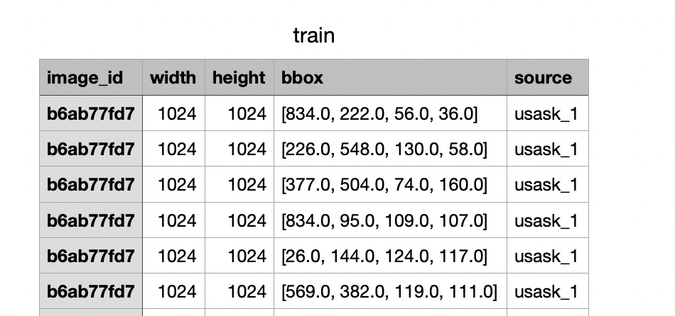
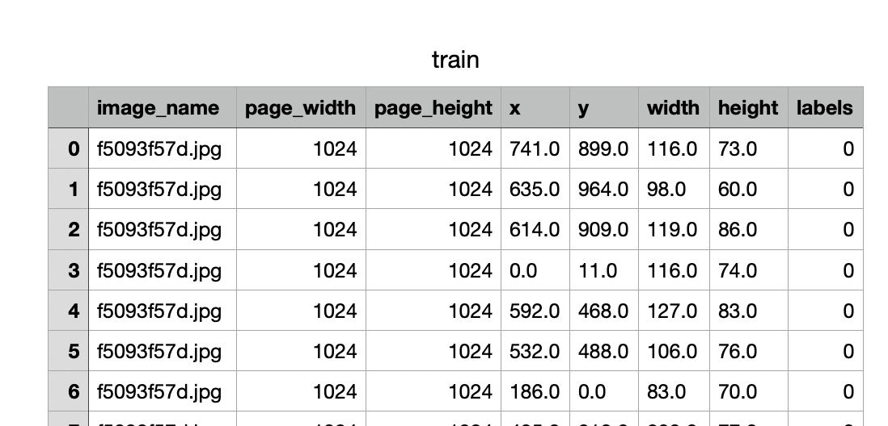

# PlantDetector
PlantDetector provides easy development (training and prediction) for object detection. [DETR](https://arxiv.org/abs/2005.12872) (End-to-End Object Detection with Transformers) is used as detection algorithm in this project. The labeled data can be used directly in training that it suitable for the label template given below. So you could use this repo for many object detection problems without any editing. There are basic three steps here.  
* Data Preparation  
* Training
* Prediction  


First of all packages must be installed. The following command is used for this installation process:
*_(It is recommended to install and run via makefile)_* 
```
  make install
```
## Data Preparation

A sample object detection problem has been solved step by step for a better understanding of the project. Global Wheat Detection was used as dataset from kaggle (https://www.kaggle.com/c/global-wheat-detection). When the data has downloaded, format of label can be seen in train.csv.  
  
This format is not suitable for our detector. So this format has to be changed. Actually There are many different labelling format in most of detection problems. When this labeled data format is changed to suitable form, the problem goes away. 
The appropriate format can be seen below. Column names (__image_name__, __page_width__, __page_height__, __x__, __y__, __width__, __height__, __labels__) are important. All column names should be like that.  
   

After this stage, the data should be made to be suitable for deep learning. You can easily run the following code for this.  
For Train:
```
  python data_preparation.py -c /Users/.../converted_train.csv -i True
```
For Test:
```
  python data_preparation.py -c /Users/.../converted_test.csv -i False
```
After that, [custom_train.json](/data/json_files/custom_train.json) and [custom_test.json](/data/json_files/custom_test.json) have been created in data folder as you will realize. 

## Training
After creation of these files, training can be started. 
```
  python train.py -n <train_image_folder_path> -t <test_image_folder_path>
```
After a few epochs, we got following result.  
    
___Average Precision  (AP) @[ IoU=0.50:0.95 | area=   all | maxDets=100 ] = 0.326  
 Average Precision  (AP) @[ IoU=0.50      | area=   all | maxDets=100 ] = 0.766  
 Average Precision  (AP) @[ IoU=0.75      | area=   all | maxDets=100 ] = 0.229  
 Average Precision  (AP) @[ IoU=0.50:0.95 | area= small | maxDets=100 ] = 0.000  
 Average Precision  (AP) @[ IoU=0.50:0.95 | area=medium | maxDets=100 ] = 0.283  
 Average Precision  (AP) @[ IoU=0.50:0.95 | area= large | maxDets=100 ] = 0.410  
 Average Recall     (AR) @[ IoU=0.50:0.95 | area=   all | maxDets=  1 ] = 0.020  
 Average Recall     (AR) @[ IoU=0.50:0.95 | area=   all | maxDets= 10 ] = 0.161  
 Average Recall     (AR) @[ IoU=0.50:0.95 | area=   all | maxDets=100 ] = 0.465  
 Average Recall     (AR) @[ IoU=0.50:0.95 | area= small | maxDets=100 ] = 0.000  
 Average Recall     (AR) @[ IoU=0.50:0.95 | area=medium | maxDets=100 ] = 0.406  
 Average Recall     (AR) @[ IoU=0.50:0.95 | area= large | maxDets=100 ] = 0.569___    
     

The results are not great (because very low epoch) but if the max_steps is increased, better result will be achived. The parametere can be change in [config.json](/config.json). As a result of the training, model has been created in model folder that named was model.ckpt. 

__Also docker can be used for training__.  
If you want to use this project via docker (default image name --> detr):
```
  make docker
```
and then;
```
  make docker_run v=<full_path_of_the_project> n=<train_image_folder_path> t=<test_image_folder_path>
```

## Prediction
The objects in different images can be detected with model that it is created after training. 
```
  python prediction.py -p /Users/..../test/sample.jpg
```
Result (label: prob):  
   


-------------------------

## TODO
- <del>Visual Prediction</del>
- Different models
- End-to-End docker process
  
